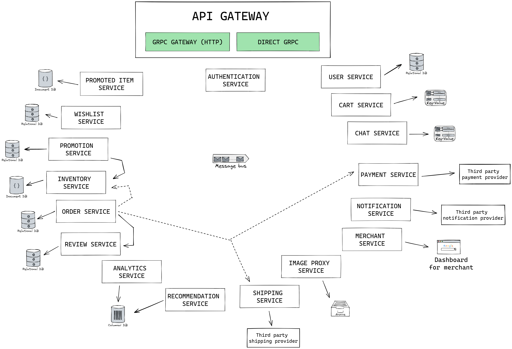

# Architecture Design

This architecture design is subject to change.

Excalidraw link: https://excalidraw.com/#json=JPBApysdZoQE1j0Tm4UBF,WbBCS-GteLqgUDsgkURP0g

- user service —> registration, profile
- authentication service —> login, logout, forgot password
- inventory service —> toko X punya produk apa aja
- cart service —> cart, bisa juga buat handle wishlist
- order service —> checkout system
- analytics service —> listen ke kafka/redpanda buat masukin ke db olap
- recommendation service (optional) —> ambil db olap over time, bikin recommendation based on behavior user
- promotion service —> coupons, automatic promotion pas di cart
- image proxy service (optional) —> convert image dari blob storage ke berbagai versi yang relevan
- payment service —> panggil third party payment gateway, keep track of stuff
- notification service —> listen ke kafka/redpanda buat ngirim push notification atau email ke user
- shipping service —> panggil third party kayak jne, sicepat, gojek, dll
- merchant service —> buat jadi entrypoint buat urusan dengan dashboard merchant
- chat service (optional) —> chat antar customer <-> merchant
- review service —> listen ke kafka/redpanda buat finished order, tagih review. nyetor list review juga.
- promoted item service (optional) —> homepage banners & products, bisa juga buat iklan
- wishlist service (optional) —> self explanatory
